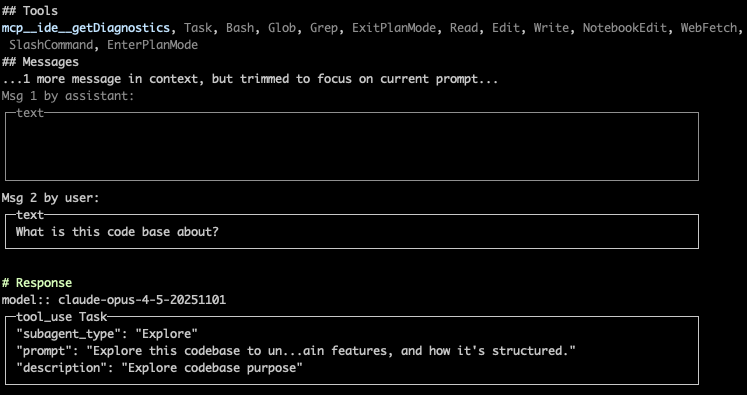
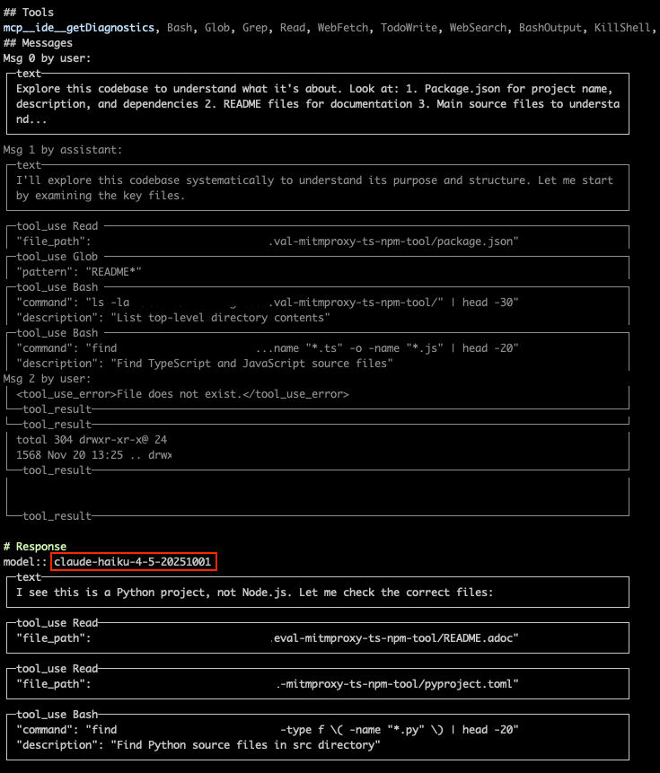
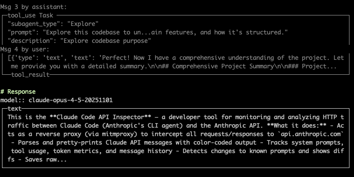

= Claude Code Api Inspector

This project inspects precisely what Claude Code requests and receives in response from the LLM Web Api.
Useful if you want to know what the agent is doing and what the context is that leads to its decisions.

== Example

Say you want to know how Claude Code does its work.
Well you can inspect what it sends to the LLM API to understand how it works.

Say you have the following prompt:

----
What is this code base about?
----

What does Claude Code do with that prompt?

It sends the prompt to the Api and it gets back the response to use the "Task" tool with the subagent "explore".

Ok so what does this subagent do?

A lot actually, here is just one of the agents in action.
Note that the tool results are not sent to Opus, but to Haiku.
Note also that Haiku returns further steps.

In the end this leads to some 15 messages being sent to Haiku which will return a summary (_"Perfect! Now I have a comprehensive understanding..."_).
This summary is then sent to Opus which will summarize it again and display the result to the user.

So a lot happens in the background before something is displayed to you.
The Api Inspector makes this transparent in your CLI.

=== Trace

The Api Inspector *logs everything to the link:trace/[] folder*.
Just in case you want to understand more of what happened.
Or in case a subagent explore floods your Cli and you cannot scroll up far enough.

== Prerequisites

=== Python

Make sure an appropriate python version is installed. If you have link:https://github.com/pyenv/pyenv[pyenv] installed, you can call:

* `pyenv local` (will install the version from link:.python-version[].

=== Mitmproxy

This project uses link:https://www.mitmproxy.org/[mitmproxy] as a reverse proxy to capture all the requests and responses that are sent.
To install it use:

`brew install mitmproxy`

== How to start

=== Setup Virtual Environment
1. Create a virtual environment by running `python3 -m venv venv` in the project directory.
2. Activate the virtual environment:
- On macOS and Linux, run `source venv/bin/activate`.
- On macOS with fish shell, run `source venv/bin/activate.fish`.
- On Windows, run `venv\Scripts\activate.bat`.

=== Install Dependencies

[source, shell]
----
pip install ".[dev]"
----

=== Format

[source, shell]
----
ruff format .
----

=== Lint and Type Check

[source, shell]
----
mypy src
ruff check .
----

Auto-fix lint errors:

[source, shell]
----
`ruff check . --fix`
----

=== Run tests

[source, shell]
----
pytest
----

=== Run tests, see missing coverage

[source, shell]
----
pytest --cov=src --cov-report=term-missing
----

== Usage

First start the proxy and pass the flow-printer-script:
`mitmdump --mode reverse:https://api.anthropic.com --listen-port 8000 -s src/print_agent_flows.py`

Then start Claude Code and pass the reverse proxy:
`ANTHROPIC_BASE_URL=http://localhost:8000/ claude`

Look in the CLI to see the requests and responses that Claude Code makes.

== Alternative Usage

You don't have to use the script though.
If you want to explore the requests/responses on your own the web interface can already help you:

`mitmweb --mode reverse:https://api.anthropic.com --listen-port 8000`

Then start Claude Code and pass the reverse proxy:
`ANTHROPIC_BASE_URL=http://localhost:8000/ claude`

Now use the web interface to see the requests and responses that Claude Code makes.

== Appendix

=== Pyenv vs Virtual Environment

* `pyenv` manages multiple versions of Python itself.
* `virtualenv/venv` manages virtual environments for a specific Python version.
